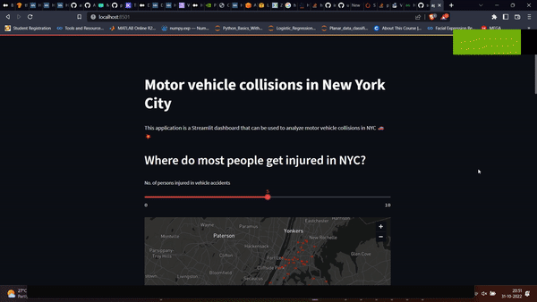

# nyc_opendata_dashboard

A single page streamlit dashboard with requisite shell scripts to deploy the webapp on AWS EC2 and provide insights on NYC OpenData Motor Vehicles crashes dataset

# DEMO



# Local installation

```
git clone https://github.com/abhimanyu911/nyc_opendata_dashboard.git

cd nyc_opendata_dashboard

pip install -r requirements.txt

streamlit run app.py
```
